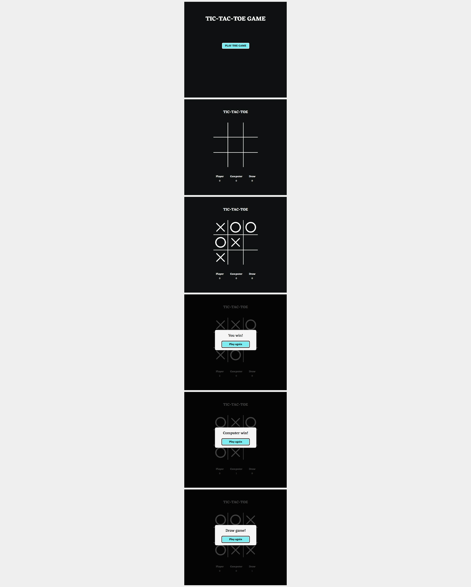

# Игра "Tic-Tac-Toe" (Angular)

Игра "Tic-Tac-Toe" (крестики-нолики)  
**Год:** 2022

## Внешний вид

## Выполненные задачи:
- SPA на Angular;
- Функционал логики и механики игры (старт игры, игровой процесс, отображение результата, возможность начать игру заново).

## Используемые технологии:
* Angular (HTML, SCSS, TypeScript)
